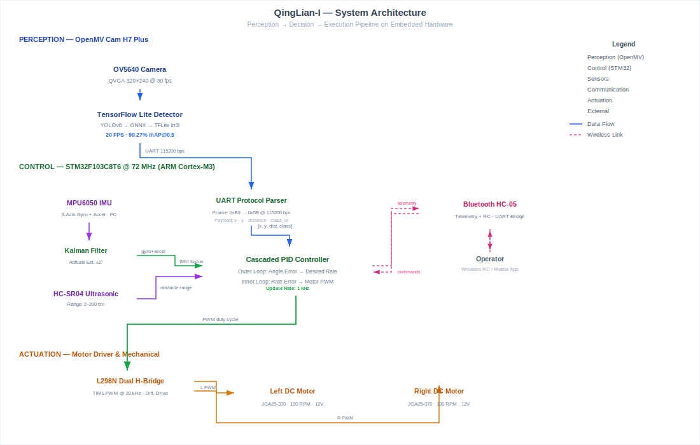

# 🌊 QingLian-I (清涟一号) — Autonomous Surface Cleaning Robot

<div align="center">

[](LICENSE)
[]()
[]()
[]()
[]()

**An autonomous water-surface robot for floating debris detection and collection,**

**powered by edge-AI vision and real-time embedded control.**

[中文说明](#中文说明) | [System Architecture](#system-architecture) | [Key Results](#key-results) | [Repository Structure](#repository-structure)

</div>

---

## Overview

**QingLian-I** (清涟一号, also known as "水域守护者") is an autonomous surface cleaning robot independently built as an undergraduate research project (Apr 2024 – Feb 2025). It integrates **computer vision**, **embedded real-time control**, and **mechanical collection** to detect and retrieve floating debris on water surfaces.

The system runs a YOLOv8-based floating-debris detector on the edge, communicates detections to an STM32F103 microcontroller via UART, and executes coordinated motion control through cascaded PID loops with IMU-based attitude stabilization. The model was trained on thousands of self-annotated images with Mosaic and synthetic wave-reflection augmentation, then pruned, quantised, and deployed to embedded hardware.

This project established the first end-to-end **perception → decision → execution** pipeline later reused and extended in the Rustbuster autonomous inspection system.

### Highlights

- **90.27% detection accuracy @ 20 FPS** under wave-reflection noise — custom-annotated floating-debris dataset
- **Full edge deployment**: YOLOv8s → ONNX → TensorFlow Lite (int8), deployed to OpenMV Cam H7 Plus
- **Data augmentation**: Mosaic + synthetic water-reflection noise via Torchvision + Albumentations
- **Sensor fusion**: MPU6050 6-axis IMU with Kalman filtering (±2° attitude estimation)
- **Cascaded PID**: outer angle loop + inner rate loop for stable differential-drive maneuvering @ 1 kHz
- **Multi-modal communication**: Bluetooth telemetry, wireless RC, UART camera link

---



### Perception Pipeline

1. **Training**: YOLOv8s trained on thousands of self-annotated floating-debris images; Mosaic + synthetic reflection augmentation for robustness under glare and wave conditions
2. **Export**: PyTorch → ONNX → TensorFlow Lite with int8 quantization
3. **Deployment**: TFLite model runs on OpenMV Cam H7 Plus at QVGA (320×240), achieving ~20 FPS inference
4. **Communication**: Detected object centroids `(x, y)` and estimated distance sent to STM32 via UART at 115200 bps

### Control Pipeline

1. **Attitude Estimation**: MPU6050 raw gyro + accelerometer → Kalman filter → Euler angles (roll, pitch, yaw)
2. **Cascaded PID**: Outer loop (angle error → desired rate) → Inner loop (rate error → motor PWM)
3. **Motion Execution**: Differential drive PWM signals to dual DC motors via L298N H-bridge
4. **Obstacle Avoidance**: HC-SR04 ultrasonic sensor triggers emergency stop / spin-search when debris < 10 cm

---

## Key Results

| Metric | Value |
|--------|-------|
| **Detection Accuracy** | 90.27% (mAP@0.5 on custom floating-debris test set) |
| **Inference Speed** | 20 FPS (OpenMV Cam H7 Plus, TFLite int8) |
| **Model Size** | < 500 KB (quantized TFLite) |
| **Control Loop Frequency** | 1 kHz (IMU read + PID update) |
| **Attitude Estimation Accuracy** | ±2° (Kalman-filtered MPU6050) |
| **Obstacle Detection Range** | 2–200 cm (HC-SR04 ultrasonic) |
| **Battery Life** | ~30 min (11.4V / 3S Li-ion, full load) |

---

## Project Context

This project was the **first complete hardware + perception + edge-deployment system** built by the author, establishing patterns later reused in the Rustbuster autonomous inspection platform:

| Capability Established | Reused In Rustbuster |
|------------------------|---------------------|
| End-to-end perception → decision → execution pipeline | Core system architecture |
| Edge model deployment (training → pruning → quantization → ONNX) | Edge AI layer |
| Sensor fusion with Kalman filtering | Multimodal perception module |
| Cascaded PID for differential-drive control | Motion control subsystem |
| UART-based camera-to-MCU communication protocol | Sensor interface design |

---

## Repository Structure

```
SurfaceCleaningRobot/
├── README.md                         # This file
├── LICENSE                           # Apache 2.0
├── .gitignore
├── firmware/
│   ├── openmv/
│   │   ├── main.py                   # Edge-AI object detection + UART communication
│   │   └── pid.py                    # Python PID controller (OpenMV side)
│   └── stm32/
│       ├── control.c / control.h     # Motion control logic + PID orchestration
│       ├── pid.c / pid.h             # C implementation of cascaded PID
│       ├── motor.c / motor.h         # PWM motor driver (TIM1, differential drive)
│       ├── kalman.c / kalman.h       # Kalman filter for IMU sensor fusion
│       ├── mpu6050.c / mpu6050.h     # MPU6050 6-axis IMU I²C driver
│       ├── echo.c / echo.h           # HC-SR04 ultrasonic sensor driver
│       ├── openmv.c / openmv.h       # UART protocol parser for OpenMV data
│       └── control_tracking.c / .h   # Camera-guided tracking controller
├── hardware/
│   ├── schematic.pdf                 # System circuit schematic
│   ├── design.jpg                    # Mechanical / PCB design drawing
│   └── circuit_design.txt            # Pin mapping reference
└── docs/
    └── images/                       # System architecture diagram (SVG)
```

---

## Quick Start

> **Note**: This repository showcases the core algorithms and system architecture. Full model weights, training datasets, and complete Keil MDK project files are **not included**. The provided code demonstrates the engineering patterns sufficient for understanding and re-implementing the approach.

### Prerequisites

- **Hardware**: STM32F103C8T6 (Blue Pill / Mini), OpenMV Cam H7 Plus, MPU6050 IMU, HC-SR04 ultrasonic, L298N motor driver, dual DC motors
- **Software**: Keil MDK-ARM v5, OpenMV IDE, Python 3.8+ (for training pipeline)

### Building the STM32 Firmware

```bash
# 1. Open Keil MDK-ARM v5
# 2. Create a new project for STM32F103C8
# 3. Add source files from firmware/stm32/ to the project
# 4. Configure STM32F10x Standard Peripheral Library
# 5. Build and flash via ST-Link / serial bootloader
```

### Running the OpenMV Detector

```python
# 1. Connect OpenMV Cam H7 Plus via USB
# 2. Open OpenMV IDE
# 3. Copy firmware/openmv/main.py and pid.py to the camera
# 4. Deploy your trained TFLite model as "trained.tflite"
# 5. Create labels.txt with your class names
# 6. Run — the camera will stream detections over UART3
```

### Training a Custom Detector

```python
# Conceptual training pipeline (not included in this repo)
from ultralytics import YOLO

# 1. Train YOLOv8 on annotated debris images
model = YOLO('yolov8s.pt')
model.train(data='debris_dataset.yaml', epochs=100, imgsz=320)

# 2. Export to ONNX
model.export(format='onnx', imgsz=320, int8=True)

# 3. Convert ONNX → TFLite (use edgeimpulse or onnx2tf)
# 4. Deploy to OpenMV as trained.tflite
```

---

## Hardware Specifications

| Component | Model | Notes |
|-----------|-------|-------|
| **Main MCU** | STM32F103C8T6 | 72 MHz Cortex-M3, 64 KB Flash, 20 KB SRAM |
| **Vision Module** | OpenMV Cam H7 Plus | STM32H743, 480 MHz, 1 MB SRAM, OV5640 sensor |
| **IMU** | MPU6050 | 6-axis (3 gyro + 3 accel), I²C interface |
| **Ultrasonic** | HC-SR04 | 2–200 cm range, 3 mm precision |
| **Motor Driver** | L298N / TB6612 | Dual H-bridge, up to 2A per channel |
| **Motors** | DC geared (JGA25-370) | 12V, 100 RPM, encoder optional |
| **Bluetooth** | HC-05 | UART transparent transmission |
| **Power** | 11.4V Li-ion (3S) | ~30 min runtime at full load |

### Pin Mapping (STM32F103C8T6)

| Function | GPIO Pin | Peripheral |
|----------|----------|------------|
| Motor PWM L | PB8, PB9 | TIM4 CH3, CH4 |
| Motor PWM R | PA0, PA1 | TIM2 CH1, CH2 |
| Motor DIR | PB14, PB15, PA6, PA7 | GPIO |
| MPU6050 I²C | PB10 (SCL), PB11 (SDA) | I2C2 |
| OpenMV UART | PA2 (TX), PA3 (RX) | USART2 |
| Bluetooth UART | PB10 (TX), PB11 (RX) | USART3 |
| Ultrasonic Trig | PB7 | GPIO |
| Ultrasonic Echo | PB6 | TIM4 CH1 (input capture) |
| Battery ADC | PA4, PA5, PA6 | ADC1 CH4, CH5, CH6 |
| Status LED | PB5 | GPIO |

---

## 中文说明

### 项目简介

**清涟一号**（又名"水域守护者"）是一款独立完成的本科科研项目（2024年4月 – 2025年2月），集成**计算机视觉**、**嵌入式实时控制**与**机械打捞装置**，用于自动检测和收集水面漂浮垃圾。

系统在 OpenMV 摄像头上运行 YOLOv8 目标检测模型，通过 UART 将检测结果传输至 STM32F103 主控芯片，经级联 PID 控制算法驱动双电机差速转向，实现自主巡航与定点打捞。模型基于数千张自标注图像训练，采用 Mosaic + 合成水面反光噪声数据增强，经剪枝与 int8 量化后部署至边缘硬件。

本项目建立了首个端到端 **感知 → 决策 → 执行** 系统 pipeline，后续被 Rustbuster 自主检测平台复用与扩展。

### 核心技术

- **边缘AI推理**：YOLOv8s → ONNX → TensorFlow Lite (int8量化)，在 OpenMV H7 Plus 上实现 20 FPS 实时检测
- **数据增强**：Mosaic + 合成水面反光噪声 (Torchvision + Albumentations)，提升复杂光照与波浪反射条件下的鲁棒性
- **姿态解算**：MPU6050 六轴IMU + 卡尔曼滤波，±2° 姿态估计精度
- **级联PID控制**：外环角度环 + 内环角速度环，1 kHz 更新频率，实现稳定的差速转向
- **多模通信**：蓝牙数传、无线遥控、UART 视觉链路

### 性能指标

| 指标 | 数值 |
|------|------|
| 漂浮垃圾检测准确率 | **90.27%** (自定义数据集，mAP@0.5) |
| 推理速度 | **20 FPS** (OpenMV, QVGA) |
| 模型大小 | < 500 KB (int8量化 TFLite) |
| 控制回路频率 | **1 kHz** (IMU读取 + PID更新) |
| 姿态估计精度 | ±2° (卡尔曼滤波) |
| 续航时间 | ~30 分钟 (11.4V / 3S锂电池) |

### 注意事项

本仓库展示核心算法与系统架构，**完整模型权重、训练数据集、Keil MDK 工程文件未包含在内**。所提供的代码足以理解系统设计思路并进行二次开发，但直接复现完整系统需自行完成模型训练与嵌入式工程配置。

---

## Acknowledgements

- **YOLOv8** by Ultralytics — base detection architecture
- **OpenMV** — embedded machine vision platform
- **STM32 Standard Peripheral Library** — hardware abstraction
- **InvenSense MPU6050 DMP** — motion processing algorithms

## License

This project is licensed under the Apache License 2.0 — see [LICENSE](LICENSE) for details.

---

<div align="center">

*Built with ❤️ for cleaner waters.*

</div>
